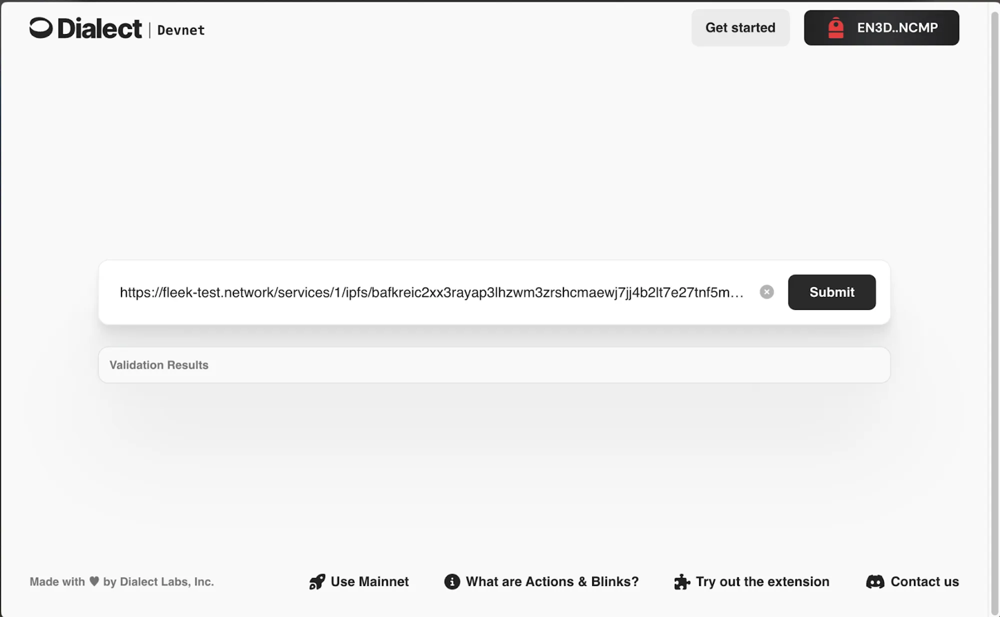
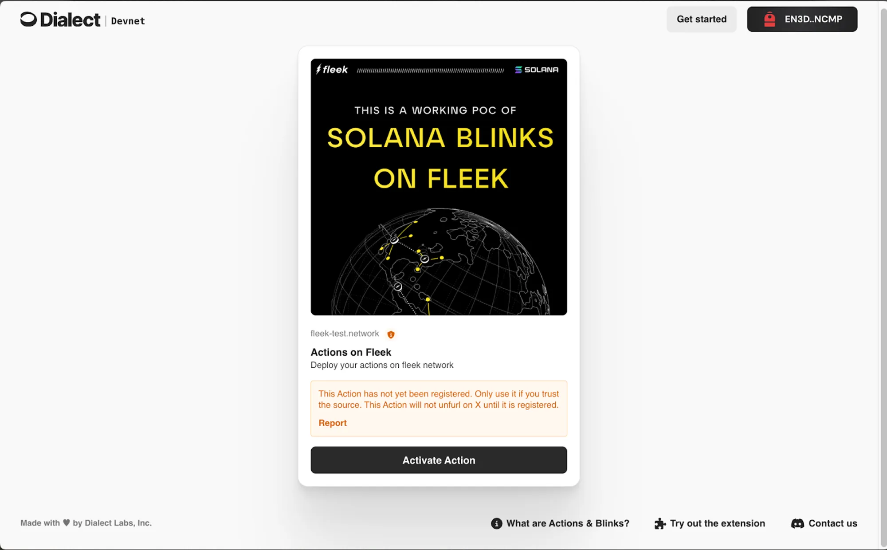
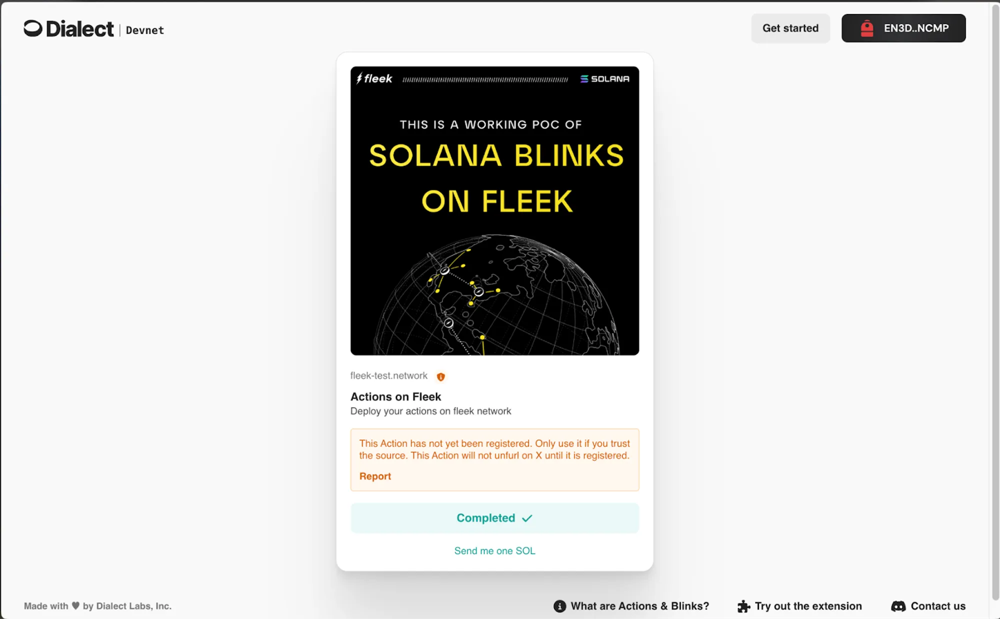

## Learn how to deploy Solana Blinks using Fleek Functions with this step-by-step guide. Unlock the potential of onchain transactions on the Solana blockchain and boost your Solana app’s performance.

As Fleek moves towards providing more full-stack support, we recently explored deploying Solana Blinks using [Fleek Functions](https://fleek.xyz/docs/cli/functions/) and unlocking the potential of blockchain technology for onchain transactions to boost your Solana app’s performance.

In this guide, we'll dive into the specifics of Solana Blinks and what makes them a perfect fit to be deployed on Fleek. We will also be discussing how HTTPS request methods can be handled by the same Fleek Function.

### Understanding Solana Actions & Blinks

Before getting started with Solana Blinks, let’s explore Solana Actions. Actions are APIs that help send transactions on the Solana blockchain. These transactions are accessible over a variety of mediums beyond just a wallet. Blinks, or Blockchain Links, transform any Solana Action into a shareable link with extensive metadata.

Solana Blinks' URL includes all the necessary details for a task, making Solana network and blockchain operations simpler and more accessible for users by transforming complex instructions into a single clickable link.

It is important to note that browser-aware clients like wallet extensions are required to be able to parse Solana Blinks and turn them into accessible user interfaces that allow interactions with Solana. These clients must decode the action API link provided in the Solana Blink URL to generate a user-friendly interface for users to complete various blockchain transactions.

Clients, such as wallets or browser extensions, use the Action's URL endpoint to make GET and POST requests, facilitating user interactions with the blockchain.

One of the main value adds of Solana Blinks is they allow Solana users to do Solana blockchain actions (Claim airdrops, buy NFTs, swap tokens etc.) directly on social media platforms like X, Farcaster, and other places where users are natively located, facilitating seamless blockchain transactions and crypto transactions.

Solana Actions deliver signable transactions or messages for user-signing directly from applications, enabling seamless interactions with the Solana network. APIs are hosted at publicly accessible URLs, allowing any client to interact with them via their URLs, which is crucial for enabling user-friendly interactions with blockchain technology.

You can learn more about Solana Actions & Solana Blinks [here](https://solana.com/docs/advanced/actions) through the Solana Foundation.

### Fleek Functions

Fleek Functions are code snippets executed server-side using Fleek’s edge-optimized onchain cloud infrastructure. Fleek Functions allow serverless execution of javascript code which you can use to develop easy and scalable ways of executing transactions on the Solana blockchain.

Fleek Functions make Solana Actions and Solana Blinks web surface capable, allowing users to perform transactions directly on any web interface that can display a URL. In this guide, we will be using the @solana/web3.js package bundled along with a Fleek Function.

The use cases for Fleek Functions go way beyond just executing Solana Actions and Solana Blinks– anywhere you would execute javascript functions, Fleek Functions may provide a more performant, lower cost, easier to maintain, self-sovereign alternative.

You can learn more about building with Fleek Functions in our [docs](https://fleek.xyz/docs/cli/functions/).

---

## Executing Solana actions, Solana Blinks and Solana transactions with Fleek Functions

Let us now look at how a Solana transaction can get executed as a Fleek Function in the form of Solana Blinks and Actions-

1. The client starts execution by making a GET request to the Fleek Function wrapping the Solana Action. The Fleek Function will respond with corresponding metadata related to the Action.
2. Icon, title, description, and label related to Solana Action are now visible. A suitable UI is rendered for it as soon as the client app (eg - a Solana wallet) parses the URL.
3. As the user interacts with the UI by clicking the button, the client makes a POST request to the Fleek Function instructing it to build the transaction.
4. Transaction is sent back to the client and upon successful signature, the wallet finally sends the transaction to the blockchain.

## The Fleek Function leverages the capabilities of the Solana network to facilitate efficient and secure transactions.

### Building a Solana Blink with Fleek Functions

Now, it’s time we start coding our own Solana Blinks on Fleek. For this example, we will be sending an onchain memo for 0.1 SOL-

1. We begin by initializing NPM in an empty directory-

```javascript
mkdir blink-on-fleek
npm init -y
```

2. Install the necessary dependency

```javascript
npm i @solana/web3.js
```

3. Create an empty javascript file called index.js and start by exporting main() so we can add logic inside it

```javascript
export const main = async (req) => {};
```

4. We must pass appropriate headers that would comply with the given specification for Solana Blinks

```javascript
export const main = async (req) => {
  const headers = [
    ['Content-Type', 'application/json'],
    ['Access-Control-Allow-Origin', '*'],
    ['Access-Control-Allow-Methods', ['GET', 'POST', 'OPTIONS']],
    ['Access-Control-Allow-Headers',
['content-type', 'accept-encoding', 'authorization'],
    ];
}
```

5. Solana Blinks require the `GET` and `POST` HTTPS methods to receive and send appropriate information. Therefore now let's track the method and build a conditional flow accordingly

```javascript
export const main = async (req) => {
    const { method } = req;
    const headers = [
    ['Content-Type', 'application/json'],
    ['Access-Control-Allow-Origin', '*'],
    ['Access-Control-Allow-Methods', ['GET', 'POST', 'OPTIONS']],
    [
      'Access-Control-Allow-Headers',
      ['content-type', 'accept-encoding', 'authorization'],
    ];

    if(method==="POST"){}
    else{}
}
```

6. Now let’s starting importing the following from `solana/web3.js`

```javascript
import {
  Transaction,
  SystemProgram,
  Connection,
  clusterApiUrl,
  PublicKey,
} from '@solana/web3.js';

export const main = async (req) => {
    const { method } = req;
    const headers = [
    ['Content-Type', 'application/json'],
    ['Access-Control-Allow-Origin', '*'],
    ['Access-Control-Allow-Methods', ['GET', 'POST', 'OPTIONS']],
    [
      'Access-Control-Allow-Headers',
      ['content-type', 'accept-encoding', 'authorization'],
    ];

    if(method==="POST"){}
    else{}
}
```

- `Transaction` class helps build the transaction object. Later on it is used to define the transaction fee payer and latest blockhash for the transaction sent and other such properties related to the transaction.
- `SystemProgram` provides a transfer method that will be used to send 0.1 SOL from one account to another.
- `Connection` and `clusterApiUrl` help maintain a secure connection with the Solana Devnet
- `PublicKey` creates a new public key object

The Solana Foundation plays a crucial role in the development and launch of features like Solana Blinks, enhancing user interaction with the Solana blockchain.

7. Now let’s _focus_ on the POST method. Here, we have to pick the public key of the account that will be signing the transaction. The public key must be sent in the body of the POST request as specified in the [Blink specification](https://solana.com/docs/advanced/actions#post-request). We will also build the transaction here as follows -

```javascript
if (method === 'POST') {
  const account = new PublicKey(req.body.account);

  let transaction = new Transaction().add(
    SystemProgram.transfer({
      fromPubkey: account,
      toPubkey: new PublicKey('<add-receiving-public-key>'),
      lamports: 100000000,
    }),
  );
}
```

8. Now, in the same conditional block, let’s make a connection to the Solana devnet, fetch the recent blockhash, and serialize the transaction. Serialized transactions must be made into a base64-encoded string to fit the Solana Action specification.

```javascript
if (method === 'POST') {
  const account = new PublicKey(req.body.account);

  let transaction = new Transaction().add(
    SystemProgram.transfer({
      fromPubkey: account,
      toPubkey: new PublicKey('<add-receiving-public-key>'),
      lamports: 100000000,
    }),
  );
  const connection = new Connection(clusterApiUrl('devnet'), 'confirmed');
  const blockHash = (await connection.getLatestBlockhash('finalized'))
    .blockhash;
  transaction.feePayer = account;
  transaction.recentBlockhash = blockHash;

  const serializedTransaction = transaction.serialize({
    requireAllSignatures: false,
    verifySignatures: true,
  });
  const transactionBase64 = serializedTransaction.toString('base64');
}
```

9. Finally, let’s build the POST Response and return it

```javascript
if (method === 'POST') {
  const account = new PublicKey(req.body.account);

  let transaction = new Transaction().add(
    SystemProgram.transfer({
      fromPubkey: account,
      toPubkey: new PublicKey('<add-receiving-public-key>'),
      lamports: 100000000,
    }),
  );
  const connection = new Connection(clusterApiUrl('devnet'), 'confirmed');
  const blockHash = (await connection.getLatestBlockhash('finalized'))
    .blockhash;
  transaction.feePayer = account;
  transaction.recentBlockhash = blockHash;

  const serializedTransaction = transaction.serialize({
    requireAllSignatures: false,
    verifySignatures: true,
  });
  const transactionBase64 = serializedTransaction.toString('base64');
  const resp = {
    transaction: transactionBase64,
    message: 'Send me one SOL',
  };
  const body = resp;
  return { body: body, headers: metaData };
}
```

10. Now that the POST method is complete, we must move to building the logic for the GET method. All we have to do is build a response object with icon, title, description and label fields. You can learn more about the GET response body specification [here](https://solana.com/docs/advanced/actions#get-response-body)

```javascript
if (method === 'POST') {
  // All the code discussed in step 9
} else {
  const resp = {};
  resp.icon =
    'https://t3.ftcdn.net/jpg/05/59/27/48/360_F_559274893_O9iSRQwTKIkAooNTglilMgx2yMcXK9Or.webp';
  resp.title = 'Actions on Fleek';
  resp.description = 'Deploy your actions on fleek network';
  resp.label = 'Activate Action';

  return { body: resp, headers: metaData };
}
```

These innovations not only streamline transactions but also foster community engagement within the Solana ecosystem.

[Here is the complete code for Solana Blinks on Fleek](https://github.com/KanishkKhurana/solana-blink-on-edge/blob/main/src/index.js)

### With this, the code for the Fleek Function is complete. It is now time to use the Fleek CLI to create and deploy this Fleek Function-

1. Install the Fleek CLI

```javascript
npm i -g @fleek-platform/cli
```

💡: We recommend using the Fleek CLI version 2.8.8 or above. To check which version you are on, please run `fleek -v`

2. Log in and select a suitable project

```javascript
fleek login
```

3. Create the Fleek Function

```javascript
fleek functions create --name myFunction
```

4. Deploy the Fleek Function

```javascript
fleek functions deploy --name myFunction --path ./index.js
```

As the Fleek function gets deployed, it will return the following output -

```javascript
Bundling code: [████████████████████████████████████████] 100% | ETA: 0s | 100/100

Uploading code to IPFS: [████████████████████████████████████████] 100% | ETA: 0s | 312773/312773

✅ Success! The deployment has been successfully created.

> You can call this Fleek Function by making a request to the following URL
🔗 https://great-exabyte-billions.functions.on-fleek.app
> You can also call this Fleek Network URL directly for increased performance (please keep in mind you will not be able to deactivate this link)
🔗 https://fleek-test.network/services/1/ipfs/bafkreic2xx3rayap3lhzwm3zrshcmaewj7jj4b2lt7e27tnf5m7ij5bxdm
```

💡: We recommend using the Fleek Network URL for the purpose of this tutorial

You can [click here](https://fleek.xyz/docs/cli/functions/) to learn more about Fleek Functions.

### Building a Solana Blink: Final Steps

Finally, head over to [dial.to](https://dial.to/devnet) to unfurl your Fleek Function into Solana Blinks.

Paste the Fleek Network URL in the input box and press submit.



Here is what the Solana Blink will look like -



After the user clicks the “Activate Action” button, the wallet will get triggered and as the transaction is confirmed, the blockchain links reach their final state as follows -



> ⚠️ : to successfully unfurl these links on apps and websites your Solana Blink must be registered with Dialect. To do that please [fill this form](https://airtable.com/appGlCDHyLzKnyljX/pagIjqCnWiA7jppHM/form).

---

Congratulations! With this you have completed the tutorial and successfully executed a Solana Blink on a Fleek Function.

You can now expand your learning to build interesting use cases on Solana and execute them as a Fleek Function for scalable and performant execution and ensure that your Solana Blink, or blockchain links, exist perpetually. These links are easily shared on social media platforms, for easy access to the Solana network for any user.

## Real-World Use Cases of Solana Blinks with Fleek Functions

The deployment of Solana Blinks through Fleek Functions isn’t just a theoretical exercise—it opens up a world of practical applications that can be transformative for both developers and end-users.

Here are some real-world use cases where Solana Blinks can significantly impact the user experience and operational efficiency:

### Seamless Token Airdrops

One of the most popular use cases for Solana Blinks is executing token airdrops. Traditionally, token airdrops require users to interact with complex interfaces, often leading to confusion and errors. With Solana Blinks deployed via Fleek Functions, these airdrops can be streamlined into a single-click operation. Users receive a simple link that, when clicked, automatically initiates the airdrop process, significantly reducing friction and improving the overall experience.

### Instant NFT Transactions on Social Platforms

One of the most popular use cases for Solana Blinks is executing token airdrops. Traditionally, token airdrops require users to interact with complex interfaces, often leading to confusion and errors. With Solana Blinks deployed via Fleek Functions, these airdrops can be streamlined into a single-click operation. Users receive a simple link that, when clicked, automatically initiates the airdrop process, significantly reducing friction and improving the overall experience.

### Effortless Token Swaps

Token swaps are another area where Solana Blinks can shine. By encapsulating the necessary transaction details within a Solana Blink, users can initiate token swaps directly from a shared link. This can be particularly useful in decentralized finance (DeFi) scenarios where speed and simplicity are crucial. Fleek Functions enable these swaps to be executed server-side, ensuring that they are both efficient and secure.

### Event Ticketing and Access Management

Solana Blinks can also be utilized in event ticketing and access management. By converting ticket purchases into a Solana Blink, event organizers can simplify the ticketing process. Attendees can receive their tickets via a link, which upon clicking, finalizes the purchase and adds the ticket to their wallet. This can be extended to access management, where the same blink can be used to verify entry, providing a seamless and integrated solution.

### Decentralized Fundraising Campaigns

Crowdfunding and fundraising campaigns can benefit immensely from Solana Blinks. Campaign organizers can share a blink that allows contributors to send funds directly to the campaign wallet. This method is not only user-friendly but also transparent, as contributors can track the transaction directly on the Solana blockchain.

### Cross-Border Payments and Remittances

Solana Blinks can also revolutionize cross-border payments and remittances. Traditionally, sending money across borders involves high fees and lengthy processing times. With Solana Blinks, users can send funds globally by sharing a simple link that initiates the transaction on the Solana blockchain.

This method drastically reduces both the time and cost associated with cross-border payments, making it an attractive option for individuals and businesses looking for efficient, low-cost remittance solutions.

### Simplified Subscription Services

Another powerful use case for Solana Blinks with Fleek Functions is the creation of decentralized subscription services. Subscription models are increasingly popular, but managing them on blockchain networks can be complex. With Solana Blinks, service providers can encapsulate the entire subscription process into a single link.

For example, a content creator could issue a Solana Blink that, when clicked, initiates a recurring payment transaction on the Solana blockchain. This not only simplifies the user experience but also ensures that the subscription process is secure and transparent, with all transactions recorded on-chain.

### The Future of Solana Blinks with Fleek Functions

As more developers and businesses recognize the potential of Solana Blinks, we can expect to see even more innovative use cases emerge. Including complex transactions in a simple, shareable link opens up endless possibilities, particularly when combined with the decentralized, serverless execution offered by Fleek Functions.

By leveraging these tools, developers can create applications that are not only more accessible but also more secure and scalable. Whether you’re facilitating on-chain transactions, enabling seamless NFT trades, or simplifying user interactions with decentralized apps, Solana Blinks and Fleek Functions offer a powerful combination that can elevate your project to the next level.

To learn more about Fleek Functions, and the additional use cases beyond Solana Blinks, check out our [docs](/docs/)!
